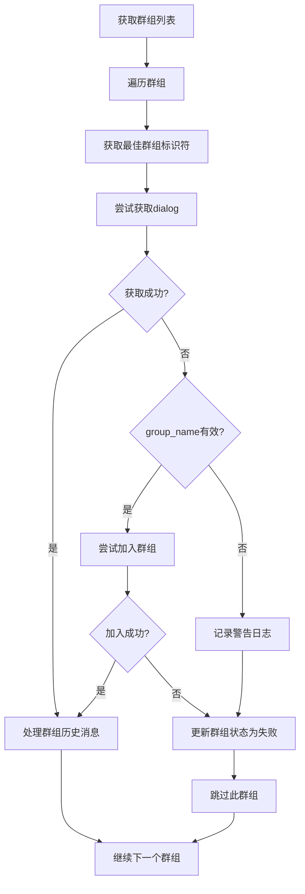

# group_name 参数处理优化方案

## 🎯 问题背景

在检查 `tg_base_history_fetcher` 调用 API 时发现，当 `group_name` 参数为空字符串或无效时，`get_dialog_with_retry` 方法可能无法正确处理群组历史消息获取。

## 🔍 问题分析

### 调用链分析
```
fetch_tg_history_job (Celery任务)
  ↓
TgHistoryTask.execute_async_task()
  ↓
ExsitedGroupHistoryFetcher.process_all_groups()
  ↓
get_chat_room_list() → 从数据库获取群组信息
  ↓
fetch_group_new_data(chat_id, group_name)
  ↓
get_dialog_with_retry(chat_id, group_name)
```

### 发现的问题

1. **`group.name` 可能为空或无效**
   - 数据库中 `tg_group.name` 字段允许为空字符串
   - 空字符串传入 `join_conversation()` 会导致加入群组失败

2. **`group_name` 与实际群组标识不匹配**
   - `group.name` 可能是用户自定义名称，不是Telegram真实标识
   - `join_conversation()` 需要群组 **username** 或 **邀请链接hash**

3. **已加入群组状态可能过期**
   - 用户可能已被踢出群组
   - 群组可能已被删除或变为私有

## 🚀 实施的优化方案

### 1. 优化 `get_dialog_with_retry` 方法 ✅

**修改内容：**
- 将 `group_name` 参数改为可选：`group_name: str = None`
- 增加 `group_name` 有效性检查：`group_name and group_name.strip()`
- 添加详细的错误处理和日志记录
- 提供明确的故障排除建议

**代码变更：**
```python
async def get_dialog_with_retry(self, chat_id: int, group_name: str = None):
    """获取dialog，失败时尝试加入群组（如果提供了有效的group_name）"""
    chat = await self.tg.get_dialog(chat_id, is_more=True)
    if not chat:
        if group_name and group_name.strip():
            # 尝试加入群组的逻辑
        else:
            logger.warning(f'chat_id {chat_id} 获取失败且group_name无效，无法自动加入群组')
            # 更新群组状态为失败
            self._update_group_status_if_failed(chat_id, group_name or f"chat_id_{chat_id}")
    return chat, chat_id
```

### 2. 增强群组信息获取逻辑 ✅

**新增方法：** `_get_best_group_identifier()`

**优化逻辑：**
- 优先使用 `group.title`（群组真实名称）
- 其次使用 `group.name`（用户设置名称）
- 最后使用 `chat_id` 作为标识符

**代码实现：**
```python
def _get_best_group_identifier(self, group):
    """获取最佳的群组标识符，优先级：title > name > chat_id"""
    if hasattr(group, 'title') and group.title and group.title.strip():
        return group.title.strip()
    if group.name and group.name.strip():
        return group.name.strip()
    return f"群组_{group.chat_id}"
```

### 3. 自动群组状态更新 ✅

**新增方法：** `_update_group_status_if_failed()`

**功能：**
- 当获取dialog失败时，自动更新数据库中群组状态为 `JOIN_FAIL`
- 添加失败原因备注信息
- 避免重复处理已失败的群组

**代码实现：**
```python
def _update_group_status_if_failed(self, chat_id: int, group_name: str):
    """当获取dialog失败时，更新群组状态为加入失败"""
    group = TgGroup.query.filter_by(chat_id=str(chat_id)).first()
    if group and group.status == TgGroup.StatusType.JOIN_SUCCESS:
        group.status = TgGroup.StatusType.JOIN_FAIL
        group.remark = f'Dialog获取失败，可能已被移出群组或群组不存在'
        db.session.commit()
```

### 4. 增强日志记录 ✅

**改进内容：**
- 添加 `logger.debug()` 记录成功获取dialog的情况
- 详细记录失败原因和建议
- 添加群组数量统计日志

## 📊 优化效果

### 🔧 功能改进

1. **向后兼容** - 现有调用代码无需修改
2. **容错能力增强** - 空/无效 `group_name` 不会导致程序崩溃
3. **状态同步** - 自动更新失效群组状态
4. **调试友好** - 详细的错误信息和建议

### 📈 性能优化

1. **避免无效重试** - 失效群组状态会被标记，减少重复处理
2. **更好的日志** - 结构化日志便于问题诊断
3. **资源节约** - 避免对已失效群组的重复操作

### 🛡️ 稳定性提升

1. **异常处理** - 完善的try-catch机制
2. **状态一致性** - 数据库状态与实际状态保持同步
3. **故障自愈** - 自动标记和跳过失效群组

## 🔄 处理流程

### 优化后的处理流程



## 🎯 使用场景

### 场景1：正常已加入群组
- **情况**：账户已加入群组，dialog获取成功
- **处理**：直接获取历史消息
- **日志**：`DEBUG` 级别记录成功

### 场景2：已被移出群组
- **情况**：数据库显示已加入，但实际已被移出
- **处理**：获取dialog失败，更新状态为 `JOIN_FAIL`
- **日志**：`WARNING` 级别记录失败并提供建议

### 场景3：群组名称无效
- **情况**：`group_name` 为空或无效字符串
- **处理**：无法自动加入，更新状态并跳过
- **日志**：详细错误信息和故障排除建议

### 场景4：群组已删除
- **情况**：群组不存在或变为私有
- **处理**：自动标记为失败状态
- **日志**：记录具体原因

## 📋 注意事项

### 数据库影响
- 会自动更新 `tg_group` 表的 `status` 和 `remark` 字段
- 只有状态为 `JOIN_SUCCESS` 的群组才会被更新

### 日志级别
- 成功操作：`DEBUG` 级别
- 警告信息：`WARNING` 级别  
- 错误信息：`ERROR` 级别

### 性能考虑
- 状态更新是同步操作，会有轻微性能开销
- 建议定期清理失效群组以提升整体性能

## 🔮 后续建议

1. **定期清理** - 建立定时任务清理长期失效的群组
2. **状态监控** - 监控群组状态变化趋势
3. **用户通知** - 考虑通知用户群组状态变化
4. **重新加入机制** - 实现失效群组的重新加入流程

---

*优化完成时间: 2025-09-13*  
*修改文件: `/jd/jobs/tg_base_history_fetcher.py`*  
*向后兼容: ✅ 现有代码无需修改*